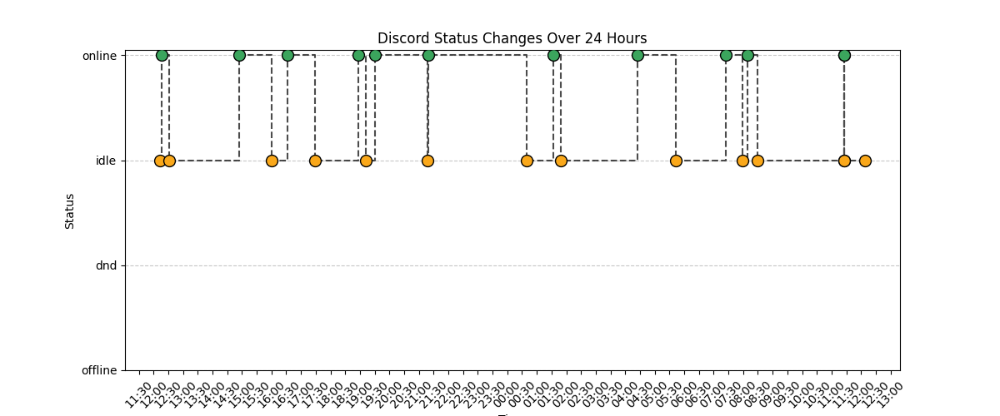

# THE WATCHER

A Discord bot built with [discord.py](https://github.com/Rapptz/discord.py) to track and monitor the status changes of users on a Discord server. THE WATCHER allows you to listen to specific users or all server members, view their status history, and generate visual reports of their activity..

## Features
- Track status changes for specific Discord users or all server members.
- Display status history and generate 24-hour activity graphs.
- Simple command-based interface for easy interaction.

## Daygraph preview


## Commands
Use the following commands to interact with THE WATCHER:
```
!daygraph {username}    Displays a graph of the last 24h changes for a user
!help                   Shows this message
!list                   list all tracked users
!listen {username}      Listens to the presence of a user by mention or plain username
!listenall              Starts tracking status changes for all members in the server
!show {username}        Shows status changes for a user by mention or plain username
!showall {username}     Shows the full status history of a user
!stop {username}        stop listening to a user
!tracked {username}     Checks if a user is tracked
```
## Prerequisites
- Python 3.8 or higher
- The [discord.py](https://discordpy.readthedocs.io/) library
- A Discord bot application with the necessary permissions
## Installation
recommended: set up a venv after cloning the bot.
```
git clone https://github.com/veritasx01/bot-watcher
cd bot-watcher
pip install -r requirements.txt
```
Enable discord intents in the discord bot dashboard for message_content, dm_messages, presences and members
then create a .env file at the root of the project and set Token as your bot's token
and optionally ID as your id in discord and run it with `python main.py`